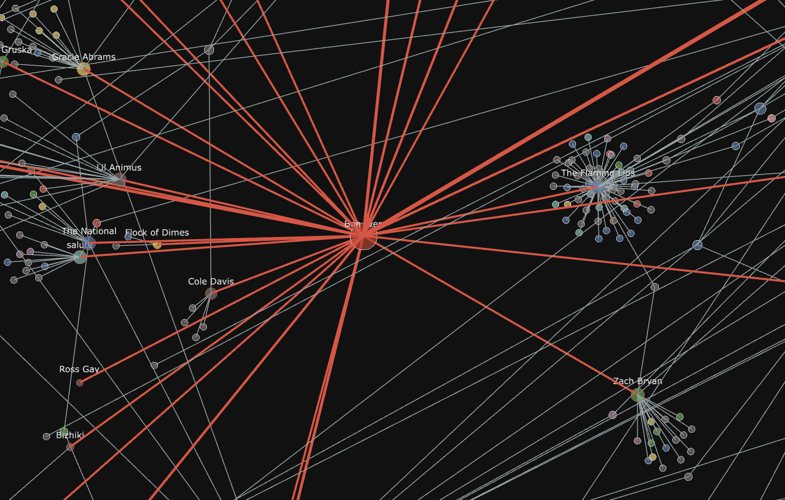

# Bon Iver (everywhere)

<p>
  <q>I'm up in the woods, I'm down on my mind </q><br>
  <em>Lost in the World</em> — Kanye West (feat. Bon Iver)
</p>

### Where is Bon Iver?

a project by Lily Holmes

* Does Bon Iver serve as a link between distinct genres?
* Which artists has Bon Iver collaborated with?
* What genres are represented in Bon Iver's discography?

Can artist connectivity be modeled through graph-based methods?

An exploration of music, genre, and networks.



**Stack:** `python`, `pandas`, `numpy`, `networkx`  
**Tools:** `ChatGPT`, `Codex`

Feel free to [explore the interactive graph](https://lily-harper.github.io/bon-iver-everywhere/).

## The data

The dataset was collected from Genius and represents featured-artist credits
within two connections of Bon Iver. The current graph contains:

- 960 artists
- 4,364 recording-credit rows
- 2,172 unique artist-to-artist connections
- 29 candidate direct collaborators
- 10 broad display genre categories

The first-hop review sheet contains 49 candidate credits. Manual review has
accepted 36, rejected 12, and left 1 pending, resulting in 24 currently accepted
direct collaborators. The filtered second-hop sheet contains 2,007 candidate
credits across 852 possible second-hop artists.

Genre labels come from MusicBrainz and are collapsed into broad categories for
the visualization. The original genre label remains in the processed artist
data. The source data can include unofficial recordings, alternate versions,
missing dates, and ambiguous artist identities, so the graph should be treated
as exploratory rather than a definitive discography.

## Rebuilding

```bash
python3 scripts/build_first_hop_review.py
python3 scripts/build_second_hop_review.py
python3 scripts/build_graph.py
```
